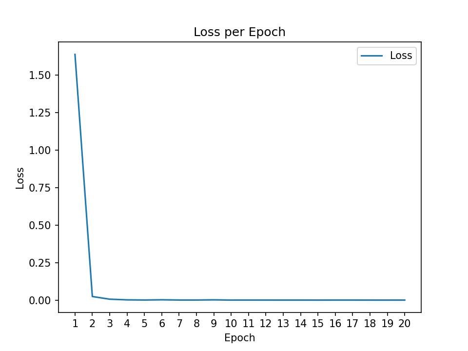
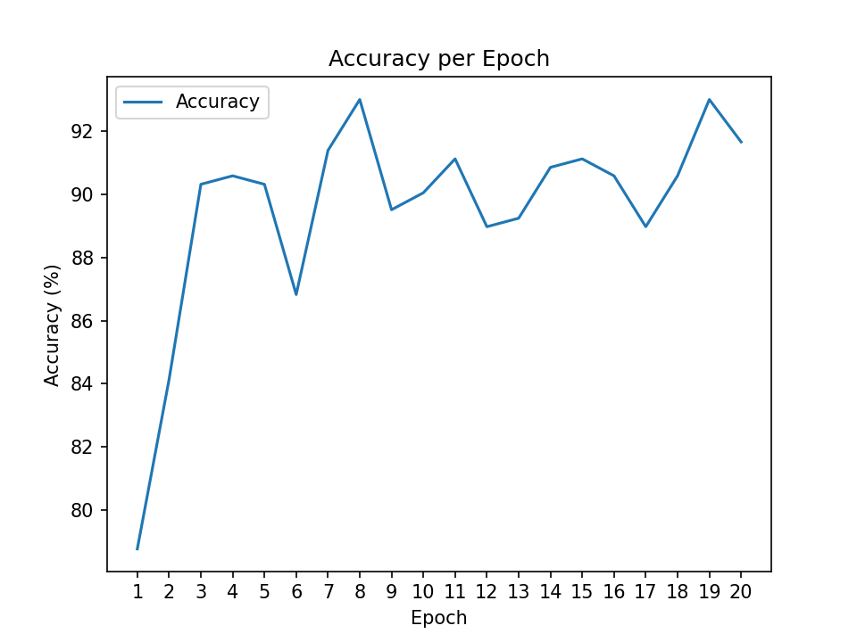

# SJTU AU3304数字图像处理基础 手势识别大作业

## 项目简介

本项目是上海交通大学 AU3304 数字图像处理基础课程的大作业，旨在实现一个手势识别系统。该系统使用卷积神经网络（CNN）对石头、剪刀、布三种手势进行分类。

这个代码可以跑到93%的准确率。

## 文件说明

- `gray_train.py`: 训练脚本，包含数据预处理、模型训练和测试的代码。
- `data_analyse.py`: 数据分析脚本，从 `data/` 目录下读取数据，分析数据的分布情况，并可视化展示。
- `data_process.py`: 数据预处理脚本，从 `data/` 目录下读取数据，将处理后的输出保存到 `data_processed/` 目录下。
- `output/`: 存储训练日志、模型权重和可视化结果的目录。

## 环境配置

看着办把，参考环境配置文件 `environment.txt`。

## 数据集

放在 `data/` 目录下，数据集的目录结构如下：

```
data/
├── rps/
│   ├── paper/
│   ├── rock/
│   └── scissors/
└── rps-test-set/
    ├── paper/
    ├── rock/
    └── scissors/
```

## 一些训练过程





